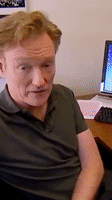

<div align="center">

# 🎬 Vertical Video Converter

**Turn horizontal podcasts, interviews, and talks into vertical clips with automatic face tracking.**

[](https://www.python.org/downloads/)
[](LICENSE)
[](https://github.com/astral-sh/ruff)
[](https://github.com/algometrix/vertical_video_convertor/pulls)

`16:9 in` ➜ `9:16 out`, with the speaker kept in frame the whole time.

</div>

---

## ✨ Features

- 🎯 **Automatic face tracking** using InsightFace (`buffalo_l` detector)
- 🧲 **Sticky subject selection**: with two hosts in frame, the camera picks one and does not flip between them when detection scores wobble
- 🎥 **Cinematic camera motion**: distance-scaled easing with a hard speed cap (one crop-width per second), so the crop never whip-pans
- ✂️ **Scene-cut aware**: hard cuts between camera angles snap instantly instead of smearing across the cut
- 🛡️ **Dropout tolerant**: brief detection losses (turned head, hand in front of the face) hold the camera instead of jerking it away
- 🧘 **No excessive tracking**: the camera does not re-aim while the face stays within a refocus band around the current aim, so a speaker swaying in their chair never drags the crop around (measured: frames with camera movement drop from 53% to 29% on real footage)
- 🔇 **Anti-jitter throughout**: detector wobble is filtered at every stage, from the raw detections down to the rendered crop
- 🎞️ **Sub-pixel panning**: the crop is sampled at the exact float camera position (bilinear), so pans glide smoothly even on low-resolution sources where 1px steps would look choppy
- 🔊 **Audio preserved** via a lossless-video ffmpeg mux
- ⚡ **GPU (CUDA) or CPU** inference, your choice at install time

Built for talking-head content: podcasts, interviews, panels, stage talks. One primary subject per shot, sitting or standing. It is intentionally simple, with no pose estimation or multi-person choreography.

## 🎥 Demo

Generated from the sample video in `assets/videos/` (left: original, right: auto-tracked vertical crop):

| Original | Vertical (auto-tracked) |
|:---:|:---:|
|  |  |
|  |  |

## 🚀 Quick Start

```bash
# 1. Install (CPU flavor; see full setup below)
uv pip install "vertical-video-converter[cpu] @ git+https://github.com/algometrix/vertical_video_convertor"

# 2. Convert
vvc podcast_episode.mp4
# -> podcast_episode_vertical_9x16.mp4, next to the input
```

Or try it on the sample video that ships with the repo (no arguments needed):

```bash
python examples/demo.py          # add --cpu to force CPU, --show for a live preview
# -> output/demo/Conan Busts His Employees Eating Cake_vertical_9x16.mp4
```

## 📦 Installation

### Prerequisites

| Requirement | Why | Install |
|---|---|---|
| Python 3.10+ | runtime | [python.org](https://www.python.org/downloads/) |
| ffmpeg + ffprobe | video probing and audio mux | see below |
| (GPU only) NVIDIA driver + CUDA 12.x | onnxruntime-gpu | [CUDA toolkit](https://developer.nvidia.com/cuda-downloads) |

**ffmpeg:**

```bash
# Ubuntu / Debian
sudo apt install ffmpeg

# macOS
brew install ffmpeg

# Windows
winget install Gyan.FFmpeg
```

### Step-by-step setup

Using [uv](https://docs.astral.sh/uv/) (recommended):

```bash
# 1. Clone
git clone https://github.com/algometrix/vertical_video_convertor.git
cd vertical_video_convertor

# 2. Create the environment and install everything in one command
uv sync --extra cpu              # CPU
uv sync --extra gpu              # OR GPU (NVIDIA, CUDA 12.x)

# 3. Verify
uv run vvc --help
```

To use the environment without the `uv run` prefix, activate it:

```bash
source .venv/bin/activate        # Linux / macOS
.venv\Scripts\activate           # Windows
vvc --help
```

> [!WARNING]
> A plain `uv sync` (no `--extra`) installs the package and dev tools but **not** onnxruntime, and a bare `uv venv` creates an empty environment. Either way the converter fails at startup with `ModuleNotFoundError`. Always pass `--extra cpu` or `--extra gpu`.

Using plain pip:

```bash
git clone https://github.com/algometrix/vertical_video_convertor.git
cd vertical_video_convertor
python -m venv .venv
source .venv/bin/activate        # Windows: .venv\Scripts\activate
pip install -e ".[cpu]"          # or ".[gpu]"
```

> [!NOTE]
> Install exactly one of `[cpu]` or `[gpu]`. They provide the same `onnxruntime` API and conflict if both are present.

> [!IMPORTANT]
> `insightface` is distributed as source and compiles a small C++ extension during install. If the install fails with a compiler error:
> - **Windows**: install [Microsoft C++ Build Tools](https://visualstudio.microsoft.com/visual-cpp-build-tools/) (select "Desktop development with C++")
> - **Ubuntu/Debian**: `sudo apt install build-essential python3-dev`
> - **macOS**: `xcode-select --install`

### Face detection model (`buffalo_l`)

Nothing to do in most cases: on first run, InsightFace automatically downloads the `buffalo_l` model pack (~280 MB) to:

| OS | Location |
|---|---|
| Linux / macOS | `~/.insightface/models/buffalo_l/` |
| Windows | `C:\Users\<you>\.insightface\models\buffalo_l\` |

If the auto-download fails (offline machine, proxy/firewall), install it manually:

```bash
# 1. Download the model pack
curl -L -o buffalo_l.zip \
  https://github.com/deepinsight/insightface/releases/download/v0.7/buffalo_l.zip

# 2. Extract into the models directory
mkdir -p ~/.insightface/models/buffalo_l
unzip buffalo_l.zip -d ~/.insightface/models/buffalo_l
```

On Windows (PowerShell):

```powershell
Invoke-WebRequest https://github.com/deepinsight/insightface/releases/download/v0.7/buffalo_l.zip -OutFile buffalo_l.zip
Expand-Archive buffalo_l.zip -DestinationPath "$env:USERPROFILE\.insightface\models\buffalo_l"
```

After extraction the directory must contain the `.onnx` files directly (e.g. `det_10g.onnx`), not a nested `buffalo_l/buffalo_l/` folder. Only `det_10g.onnx` is actually used here (detection only), but shipping the whole pack keeps InsightFace happy.

> [!TIP]
> **GPU not being used?** Run `python -c "import onnxruntime; print(onnxruntime.get_available_providers())"`. You should see `CUDAExecutionProvider` in the list. If not, check your NVIDIA driver and CUDA version against the [onnxruntime compatibility matrix](https://onnxruntime.ai/docs/execution-providers/CUDA-ExecutionProvider.html).

## 🎮 Usage

### Command line

```bash
vvc input.mp4                          # 9:16 next to the input
vvc input.mp4 -o ./out -r 4/5          # 4:5 into ./out
vvc input.mp4 --cpu --show             # CPU inference + live preview
vvc input.mp4 --compare                # preview original | converted side by side
```

| Option | Default | Description |
|---|---|---|
| `-o, --output-dir` | next to input | output directory |
| `-r, --ratio` | `9/16` | output aspect ratio, `W/H` |
| `--height-ratio` | `1.0` | crop height as a fraction of source height |
| `--headroom` | `0.42` | face position in the crop (0.5 = centered, smaller = higher) |
| `--hold-seconds` | `2.0` | hold time on detection dropouts before recentering |
| `--scene-threshold` | `28.0` | scene-cut sensitivity (lower = more sensitive) |
| `--refocus-band` | `0.03` | no re-aim while the face stays within this fraction of frame width of the current aim (larger = calmer camera, `0` disables) |
| `--det-size` | `640` | face detector input size (smaller = faster) |
| `--cpu` | off | force CPU inference |
| `--show` | off | live preview window (press `q` to stop) |
| `--compare` | off | preview original and converted side by side (implies `--show`) |

Preview windows are capped at 400px height; width follows the aspect ratio.

### Python API

```python
from vertical_video_converter import VerticalVideoConverter

converter = VerticalVideoConverter(use_gpu=True)
output = converter.create_vertical_video(
    "podcast_episode.mp4",
    output_dir="clips/",
    aspect_ratio="9/16",
)
print(output)  # clips/podcast_episode_vertical_9x16.mp4
```

The tracking pieces are importable on their own (no InsightFace needed):

```python
from vertical_video_converter import FaceTracker, TargetSmoother, SceneCutDetector
```

## 🔍 How It Works

```
input.mp4
   │
   ▼
VideoReader (thread) ──► InsightFace detection (GPU/CPU)
   │                                 │
   │                                 ▼
   │                     FaceTracker: sticky main-face pick + dropout hold
   │                                 │
   │                                 ▼
   │                     SceneCutDetector: hard cut? reset + snap
   │                                 │
   │                                 ▼
   │                     TargetSmoother: eased, speed-capped camera
   │                                 │
   │                                 ▼
   └──────────────────► crop ──► CropSmoother ──► VideoWriter (thread)
                                                       │
                                                       ▼
                                        ffmpeg audio mux ──► output.mp4
```

The tracking rules are distilled from a much larger production tracker and are documented in the module docstrings. The load-bearing ones:

1. **Sticky selection** (`face_tracker.py`): the current face keeps the camera unless a challenger scores 50% higher. Re-picking "the best face" fresh every frame flips between similar faces.
2. **Refocus band** (`smoothing.py`): the camera aim only changes when the face escapes a band around it (default 3% of frame width). Wobble and sway inside the band leave the crop perfectly still; a real move is followed with one band radius of lag. Tune with `--refocus-band`: larger = calmer, `0` disables.
3. **Speed cap** (`smoothing.py`): camera movement is capped at one crop-width per second regardless of source fps. Uncapped easing reads as whip-pans at 60fps.
4. **Cut snap** (`scene_detector.py`): on a hard cut, all tracking state resets and the crop teleports. Easing across a cut drags stale coordinates into the new shot.
5. **Sub-pixel rendering** (`cropping.py`): the crop is sampled at the float camera position with bilinear interpolation instead of integer pixel offsets, so panning stays smooth on low-res sources. When the camera is stationary, the sample position snaps to the pixel grid so static shots stay perfectly crisp.

## 🛠️ Development

```bash
uv sync --extra cpu --group dev    # env with cpu + dev tools
uv run pytest                      # tests
uv run ruff check .                # lint
uv run ruff format .               # format
```

## 📁 Project Structure

```
├── assets/videos/         # sample video used by the demo
├── examples/
│   └── demo.py            # converts the sample video (python examples/demo.py)
├── src/vertical_video_converter/
│   ├── converter.py       # pipeline orchestration + ffmpeg mux
│   ├── face_tracker.py    # sticky main-face selection, dropout hold
│   ├── smoothing.py       # eased camera, refocus band, anti-jitter
│   ├── cropping.py        # sub-pixel crop sampling
│   ├── scene_detector.py  # hard-cut detection
│   ├── video_reader.py    # background frame reader
│   ├── video_writer.py    # background frame writer + preview
│   └── cli.py             # `vvc` entry point
└── tests/                 # unit tests for the tracking pieces
```

## 🤝 Contributing

Issues and PRs are welcome. Before submitting, run `uv run pytest` and `uv run ruff check .`.

## 📄 License

[MIT](LICENSE)

## 🙏 Acknowledgements

- [InsightFace](https://github.com/deepinsight/insightface) for the face detection models
- [ONNX Runtime](https://onnxruntime.ai/) for inference
- [FFmpeg](https://ffmpeg.org/) for everything video
